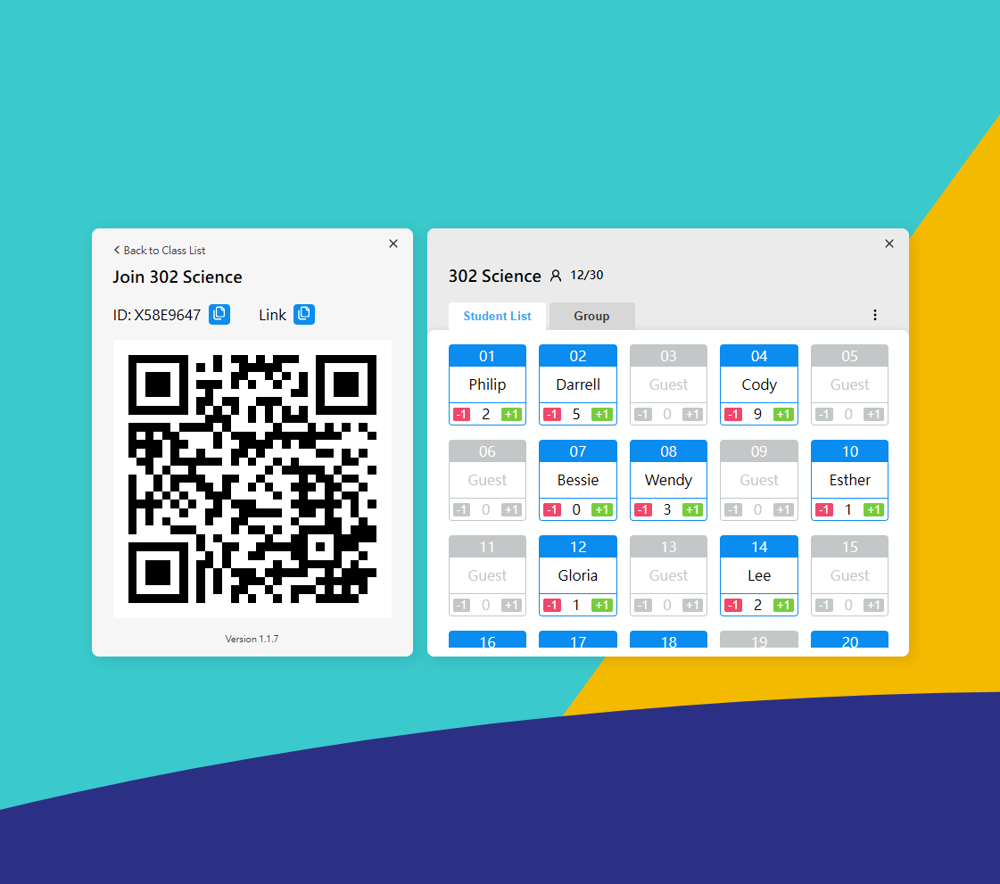

# View Sonic Assignment



網站採用 React、Redux、styled-components 開發，搭配 lucide-react 圖示與 MSW 的 API 假資料，沒有其他額外的依賴。

檔案與資料夾名稱都是採用 Next.js 的全小寫規則。

```
# 安裝依賴
pnpm install

# 本地專案執行
pnpm run dev
```

## 實作

偏好 Shadcn UI 或 Radix UI 的可組合元件風格，參考其使用方式實作了 `dialog` `popover` `tabs` 簡易版的共用元件。

Store 的結構以滿足題目條件與能讓元件有效率存取為主要考量，邏輯在 `@/features/class/class-slice.ts` 這支檔案。

## 專案結構

- app - 主要是 store 設定與初始發出 API 的頁面
- components - 可組合共用元件
- constants - API 基礎路徑與 RWD 設定
- features - 主要有教室 (classroom) 與加入教室 (join-class) 兩個元件。Store 的 class 屬性結構放在 class/class-slice 檔案。
- mocks - 包含取得課程資訊與加入學員兩支 API
- services/api - 將呼叫 API 包裝成 hook 提供類似 RTK Query 的操作
